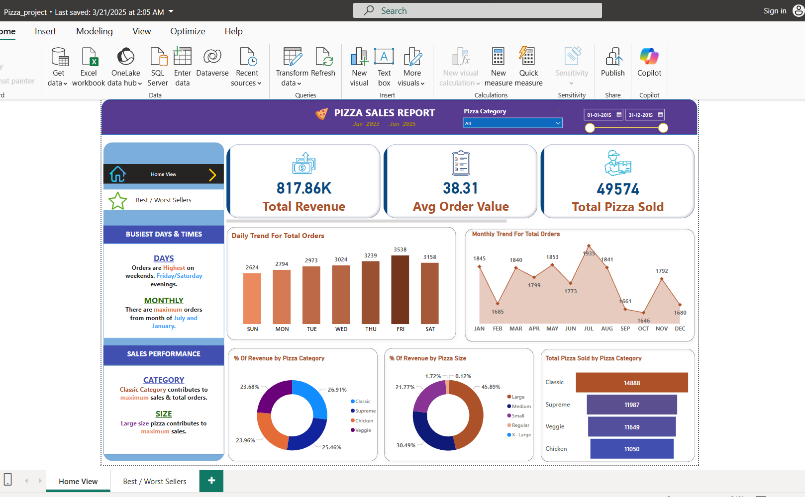
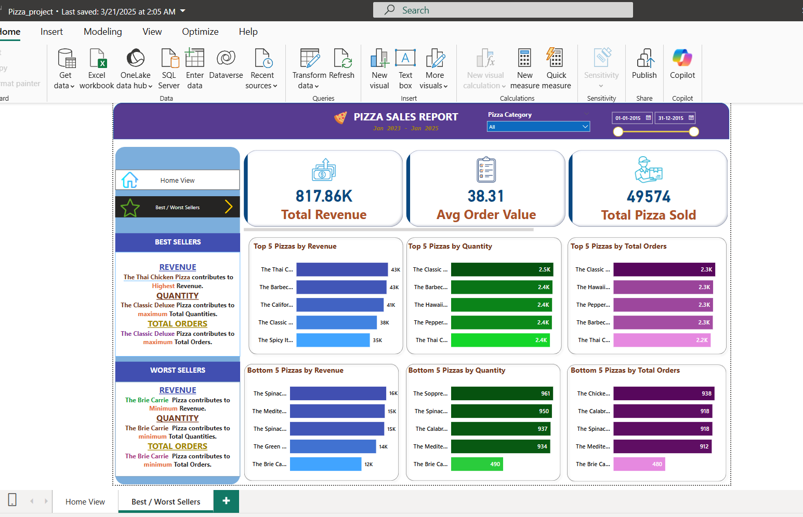

# 🍕 Pizza Sales Dashboard

This Power BI dashboard provides an insightful analysis of pizza sales data, helping the business optimize sales, inventory, and customer engagement. The report demonstrates advanced Power BI capabilities, including:

## 📊 **Key Insights**

1. **Revenue Trends:** Analysis of daily, weekly, and monthly sales trends.
2. **Top-Selling Pizzas:** Identification of best-performing pizzas by category and revenue.
3. **Order Patterns:** Insights into peak order times and busiest days.
4. **Customer Segmentation:** Breakdown of sales by customer demographics.
5. **Inventory Management:** Tracking low-stock items and managing restock cycles.

## 🛠️ **Technical Highlights**

✅ **Data Modeling:**  
   - Relationship establishment between sales, orders, and product tables.  
   - Fact-Dimension model for optimized performance.  

✅ **DAX Measures:**  
   - Dynamic revenue and sales calculations.  
   - Time intelligence functions for YTD and MTD comparisons.  

✅ **Advanced Visuals:**  
   - Slicers and drill-throughs for interactive filtering.  
   - Heatmaps and KPIs for better visualization.

## 📥 **Download Report**
[Click Here to Download](./Pizza_Sales_Report.pbix)

## 📸 **Dashboard Previews**

## 📸 **Home Page Preview**

## 📸 **Performance Page Preview**

## 🚀 **How to Run the Project**
1. Download the `.pbix` file.
2. Open it in **Power BI Desktop**.
3. Refresh the data source to load the latest data.

## 📚 **Additional Notes**
- This project demonstrates data visualization, DAX, and interactive reporting skills.
- Ideal for business optimization use cases.
